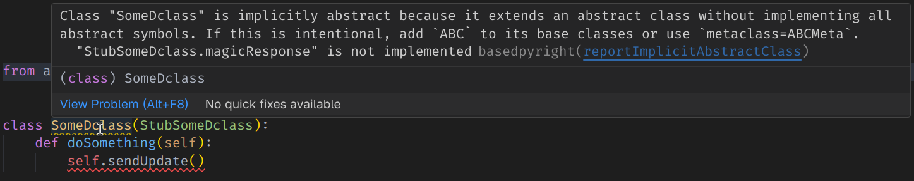
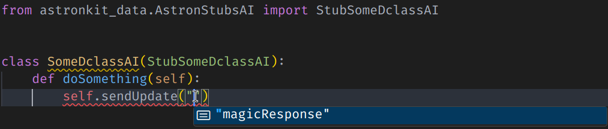
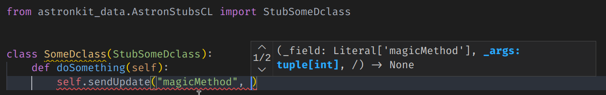

# AstronKit

Astron Kit enables strictly-typed distributed messages.
It can automatically parse dclasses using Panda3D machinery and output their stubs. Those stubs can be inherited by actual
classes of the application, which allows for "compile-time" checking and improved IDE support!

### Warning 

- Astron Kit is in early stages of development. Use at your own risk.
- Since python's lists can't be typed heterogenously, Astron Kit turns the argument lists for sendUpdate calls
  into tuples. If you use lists (which you probably do), you will get typechecker errors.

### Usage

- Use at least Python 3.8.
- Install AstronKit and Panda3D.
- Run `python -m astronkit path_to_dc_file [path_to_other_dc_file...]`
    - Note: this should be run with an appropriate Python version. For example, if you compile your application
      using Python 3.8, you should also run this with Python 3.8 to avoid modern syntax from being added there.
- Inherit your classes from the stubs generated under `astronkit_data`
- Receive benefits, such as:
    - Abstractness checking and input argument typechecking
    

    - Autocompletion for sendUpdate method names (with an appropriate IDE)
    

    - Typechecking for sendUpdate parameters (with an appropriate IDE)
    
